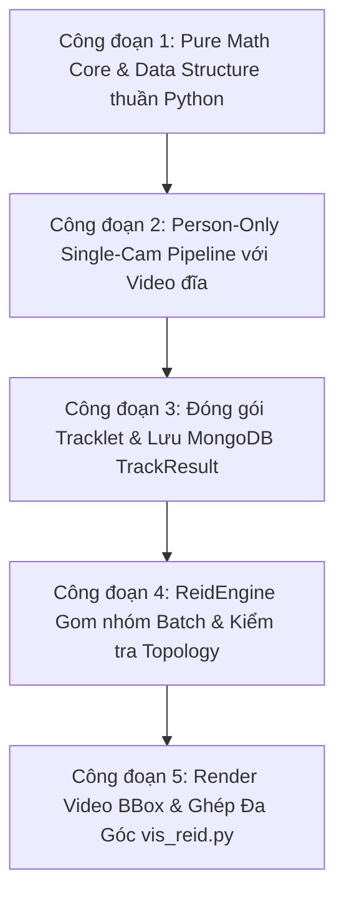

# HƯỚNG DẪN XÂY DỰNG MULTI-CAMERA TRACKING & RE-ID CHẾ ĐỘ OFFLINE (TINH GỌN - CHỈ THEO DÕI CON NGƯỜI)

> **Tác giả**: Senior Software Architect & Lead AI Engineer  
> **Mục tiêu**: Hướng dẫn từng bước (Step-by-step), tư duy thiết kế (Mindset), và các lưu ý kỹ thuật khi tự tay xây dựng hệ thống **Multi-Camera Person Tracking & Re-Identification Chế độ Offline (`REID.online: No`)** — Bỏ qua toàn bộ các module nhận diện hành vi (bàn tay, chạm đồ, kệ hàng) để tập trung 100% vào việc **Theo dõi & Định danh Con người**.

---

## 1. Tư duy Tinh gọn & Phạm vi Dự án (Streamlined Scope & Mindset)

### 1.1 Lợi ích của việc Bỏ qua Module Hành vi (Action Detection) ở giai đoạn đầu
* **Giảm 70% độ phức tạp của Code**: Bạn không cần code module phát hiện bàn tay (`hand_tracking.py`), gán vị trí tay vào người (`associate_hand_to_person`), hay vẽ các vùng đa giác ROI kệ hàng (`event_handler.py`).
* **Tốc độ Xử lý nhanh gấp 2-3 lần**: GPU chỉ cần chạy 1 model AI Detect Con người (`person`) thay vì phải chạy thêm model Detect Bàn tay (`hand`).
* **Tập trung 100% vào Lõi Cốt lõi**: Hoàn thiện bài toán: **Khách xuất hiện ở Cam 1 $\rightarrow$ sang Cam 2 $\rightarrow$ sang Cam 3 có giữ đúng 1 Global ID duy nhất hay không?**

---

### 1.2 Luồng Dữ liệu Tinh gọn (Streamlined Offline Pipeline Diagram)

```text
[ Video File .mkv / .mp4 ] ──► [ FileVideoStream Thread ]
                                     │
                                     ▼
                        [ InfEngine Process per Cam ]
                                     │
                      ├── 1. Person Detection (YOLOv5 Person Only)
                      ├── 2. Single-Cam Person Tracking (SORT / Kalman)
                      └── 3. Feature Vectorization (FastReID 256-dim + View)
                                     │
                                     ▼ (Save Tracklet when real_dead_tracks)
                        [ MongoDB collection: TrackResult ]
                                     │
                                     ▼ (After ALL InfEngine Processes finish)
                        [ ReidEngine Process ]
                                     │
                      ├── 1. Read ALL TrackResult from MongoDB
                      ├── 2. SORT TrackResults by end_time (TĂNG DẦN)
                      ├── 3. Cosine Distance Matching & View Filtering
                      └── 4. Topology Rules (check_dup_time, check_move_time)
                                     │
                                     ▼
                        [ Multi-Cam Render & Stitching ]
                        (vis_reid.py -> Output all_cams_reid.mkv)
```

---

## 2. Lộ trình 5 Công đoạn Triển khai Chi tiết



---

### CÔNG ĐOẠN 1: Pure Math Core & Data Structure thuần Python

Mục tiêu: Xây dựng các hàm toán học nền tảng trên RAM. Chưa sử dụng Docker, Triton hay MongoDB.

* **Bước 1.1 (Tính IoU đè nhau)**:
  * Viết hàm `calculate_iou(boxA, boxB)` tính tỷ lệ giao cắt giữa 2 ô chữ nhật $[x_1, y_1, x_2, y_2]$.
* **Bước 1.2 (Tính Cosine Distance)**:
  * Viết hàm `cosine_distance(vec1, vec2)` đo độ lệch góc giữa 2 mảng đặc trưng 256 chiều:
    $$\text{Distance} = 1.0 - \frac{\vec{A} \cdot \vec{B}}{\|\vec{A}\| \|\vec{B}\|}$$
* **Bước 1.3 (Mock Tracker & Mock ReID Engine)**:
  * Viết class `SimpleTracker`: Dùng IoU đè nhau giữa frame $t$ và $t-1$ để gán ID tạm thời.
  * Viết class `SimpleReIDEngine`: Dùng `self.customers_db = {}` trong RAM so khớp vector đặc trưng giả để cấp Global ID `1001`, `1002`.
* 👉 **Code mẫu chạy thử độc lập tại**: [`scratch/core_logic_demo.py`](file:///c:/Users/Admin/Downloads/tmp_prj/tmp_prj/scratch/core_logic_demo.py).

---

### CÔNG ĐOẠN 2: Person-Only Single-Cam Pipeline với Video File đĩa

Mục tiêu: Đọc file video đĩa `.mkv`, phát hiện người, theo dõi đơn camera và trích xuất vector đặc trưng.

* **Bước 2.1 (Threaded Stream Loader)**:
  * Viết [`src/modules/loader/stream.py`](file:///c:/Users/Admin/Downloads/tmp_prj/tmp_prj/src/modules/loader/stream.py) (`FileVideoStream`): Dùng `cv2.VideoCapture` chạy background thread đọc từng frame video đĩa nạp vào `queue.Queue`.
* **Bước 2.2 (YOLOv5 Person Detector)**:
  * Viết [`src/modules/detection/yolov5/yolov5_triton.py`](file:///c:/Users/Admin/Downloads/tmp_prj/tmp_prj/src/modules/detection/yolov5/yolov5_triton.py): Gọi Triton model `person_det_yolov5_640`.
  * **LƯU Ý TINH GỌN**: Chỉ lọc ra Bounding Box của class `person` (người), bỏ qua hoàn toàn class `hand` (bàn tay).
* **Bước 2.3 (SORT Multi-Object Tracker)**:
  * Viết [`src/modules/tracking/person_tracking.py`](file:///c:/Users/Admin/Downloads/tmp_prj/tmp_prj/src/modules/tracking/person_tracking.py) (`PersonTracker`): Dùng Kalman Filter dự đoán tọa độ khung hình tiếp theo và Hungarian Algorithm để nối ô BBox giữa các khung hình.
* **Bước 2.4 (FastReID Vectorization & View Classifier)**:
  * Viết [`src/modules/vectorization/fastreid/fastreid_triton.py`](file:///c:/Users/Admin/Downloads/tmp_prj/tmp_prj/src/modules/vectorization/fastreid/fastreid_triton.py): Cắt ảnh người (crop image), gọi Triton model `person_vec_view_upbody_osnet_x1.0` trích vector 256-dim.
  * Gọi Triton model `person_view` phân loại góc nhìn người (`front`, `side`, `back`).

---

### CÔNG ĐOẠN 3: Đóng gói Tracklet & Lưu MongoDB `TrackResult`

Mục tiêu: Khi một người bước ra khỏi góc quay của camera (`real_dead_tracks`), đóng gói dữ liệu tối giản và lưu vào MongoDB.

* **Bước 3.1 (Định nghĩa Schema MongoDB)**:
  * Kết nối MongoDB ([`database.py`](file:///c:/Users/Admin/Downloads/tmp_prj/tmp_prj/src/services/mongo/database.py)).
  * Tạo MongoEngine Document `TrackResult` tại [`src/modules/data_template/customer.py`](file:///c:/Users/Admin/Downloads/tmp_prj/tmp_prj/src/modules/data_template/customer.py#L42):
    ```python
    class TrackResult(Document):
        track_info = StringField(required=True)  # Chuỗi pickle/base64 mã hóa Tracklet
    ```
* **Bước 3.2 (Đóng gói Tracklet Tinh gọn)**:
  * Cấu trúc một gói `Tracklet` tinh gọn chỉ cần chứa:
    ```python
    {
        'cam_id': 'CAM360-111',
        'track_id': 5,                   # ID tạm thời ở Cam 1
        'start_time': datetime(...),      # Lúc bước vào Cam 1
        'end_time': datetime(...),        # Lúc rời Cam 1
        'rep_vectors': [vec1, vec2, ...], # Top 5-10 vector đặc trưng nét nhất
        'view_labels': ['front', 'side']  # Nhãn góc nhìn tương ứng
    }
    ```
  * Trong [`src/processes/inference_engine.py:L250`](file:///c:/Users/Admin/Downloads/tmp_prj/tmp_prj/src/processes/inference_engine.py#L250): Khi `person_track_manager` trả về `real_dead_tracks`, gọi `TrackResult(track_info=...).save()`.

---

### CÔNG ĐOẠN 4: ReidEngine Gom nhóm Batch & Kiểm tra Topology

Mục tiêu: Sau khi tất cả camera quay xong, đọc toàn bộ `TrackResult` từ MongoDB, sắp xếp theo thời gian và so khớp ReID đa camera.

* **Bước 4.1 (Kích hoạt Sau cùng)**:
  * Tại [`src/main.py:L85`](file:///c:/Users/Admin/Downloads/tmp_prj/tmp_prj/src/main.py#L85): Đợi tất cả các tiến trình camera `inf_process` chạy xong hết file video đĩa, mới bật tiến trình `reid_process`.
* **Bước 4.2 (Sắp xếp Thời gian end_time Tăng dần - QUAN TRỌNG NHẤT)**:
  * Trong [`src/processes/reid_engine.py:L194`](file:///c:/Users/Admin/Downloads/tmp_prj/tmp_prj/src/processes/reid_engine.py#L194):
    ```python
    # Đọc tất cả TrackResult từ MongoDB và SẮP XẾP TĂNG DẦN THEO end_time:
    track_results = TrackResult.objects(...)
    track_results.sort(key=lambda x: x['end_time'])

    for message in track_results:
        self.do_reid(message)
    ```
* **Bước 4.3 (So khớp ReID & Ràng buộc Topology)**:
  * So khớp Cosine Distance đa góc nhìn và Majority Voting ([`attrs_matching.py`](file:///c:/Users/Admin/Downloads/tmp_prj/tmp_prj/src/modules/matching/attrs_matching.py)).
  * Kiểm tra ràng buộc thời gian trùng `check_dup_time()` và thời gian di chuyển vật lý giữa các camera `check_move_time()` ([`customer_manager.py`](file:///c:/Users/Admin/Downloads/tmp_prj/tmp_prj/src/modules/reid/customer_manager.py)).
* **Bước 4.4 (Lưu Hồ sơ Khách hàng)**:
  * Cập nhật/Tạo mới các Document MongoDB: `Customer`, `Person`, `Session` và bản đồ ánh xạ `Track2Cust`.

---

### CÔNG ĐOẠN 5: Render Video BBox & Ghép Đa Góc quay (`vis_reid.py`)

Mục tiêu: Đọc `Track2Cust` từ MongoDB, vẽ Bounding Box + Global ID `c_id` đè lên từng video gốc và ghép thành file video duy nhất `all_cams_reid.mkv`.

* **Bước 5.1**: Mở [`src/vis_reid.py`](file:///c:/Users/Admin/Downloads/tmp_prj/tmp_prj/src/vis_reid.py).
* **Bước 5.2**: Đọc bảng `Track2Cust` để biết `track_id` tạm ở từng camera tương ứng với Global ID `c_id` nào (ví dụ: `Track #5` ở Cam 1 $\iff$ Global ID `#1001`).
* **Bước 5.3**: Đọc từng frame video gốc, dùng OpenCV `cv2.rectangle()` và `cv2.putText()` vẽ ô vuông BBox và chữ **`Customer #1001`** lên trên đầu người mua hàng.
* **Bước 5.4**: Gọi lệnh FFmpeg qua `subprocess` ghép 4 luồng video đã vẽ BBox thành 1 file video duy nhất [`all_cams_reid.mkv`](file:///c:/Users/Admin/Downloads/tmp_prj/tmp_prj/src/vis_reid.py#L219) hiển thị đồng thời 4 góc quay!

---

## 3. Các Lưu ý Kỹ thuật Sống còn (Engineering Pitfalls & Best Practices)

### ⚠️ Lưu ý 1: Cân chỉnh Ngưỡng Khoảng cách Cosine (Cosine Distance Threshold)
* Ngưỡng Cosine chuẩn cho model FastReID OSNet: `0.35` đến `0.40`.
* Nếu khoảng cách $< 0.35 \rightarrow$ Coi là cùng 1 người.
* Nếu khoảng cách $\ge 0.40 \rightarrow$ Tạo mới Khách hàng.
* **Mẹo**: Đừng để ngưỡng quá thấp ($< 0.25$) vì góc quay khác nhau giữa các camera làm vector bị lệch nhẹ, nếu để quá thấp sẽ bị đẻ ra nhiều ID trùng cho cùng 1 người.

### ⚠️ Lưu ý 2: Chọn Ảnh Crop Chất lượng (Representative Frame Selection)
* Đừng lấy tất cả 100 ảnh crop của một người trong 1 camera (vì có ảnh mờ, ảnh bị che khuất).
* Dùng module [`select.py`](file:///c:/Users/Admin/Downloads/tmp_prj/tmp_prj/src/modules/selection/select.py) lọc ra **Top 5-10 bức ảnh sắc nét nhất, rõ dáng nhất** để trích vector. Chất lượng vector tốt sẽ giúp ReID chính xác hơn $30\%$.

### ⚠️ Lưu ý 3: Dọn dẹp Bộ nhớ RAM đệm (`CustomerManager.check_timeout_customers`)
* Trong quá trình ReID, các vector khách hàng được lưu tạm vào RAM `GalleryManager`.
* Nếu xử lý video đĩa dài có hàng trăm người, RAM sẽ bị đầy liên tục.
* **Giải pháp**: Gọi `check_timeout_customers()` xóa khỏi RAM các khách hàng đã biến mất khỏi cửa hàng quá 5 phút ($> 300\text{s}$).

### ⚠️ Lưu ý 4: Đồng bộ Mốc Thời gian giữa các File Video
* Đảm bảo các file video đĩa thử nghiệm (`cam1.mkv`, `cam2.mkv`) được cắt bắt đầu ở **CÙNG MỘT MỐC THỜI GIAN THỰC TẾ** (ví dụ cùng bắt đầu lúc 10:00:00). Nếu mốc thời gian bị lệch mà không khai báo trong `loader.yaml`, hàm `check_move_time()` sẽ tính toán sai thời gian di chuyển.

---

## 4. Checklist Kiểm thử & Định nghĩa Hoàn thành (Definition of Done)

* [ ] **DoD-1**: Script core math độc lập [`scratch/core_logic_demo.py`](file:///c:/Users/Admin/Downloads/tmp_prj/tmp_prj/scratch/core_logic_demo.py) chạy 100% đúng kết quả IoU và Cosine Distance.
* [ ] **DoD-2**: Đọc 1 file video đĩa, YOLOv5 chỉ detect người (`person`), SORT Tracker cấp ID mượt mà không bị nhảy vết.
* [ ] **DoD-3**: Khi người đi ra khỏi camera, MongoDB lưu đúng bản ghi `TrackResult` chứa mảng vector 256 chiều.
* [ ] **DoD-4**: Tiến trình `ReidEngine` đọc `TrackResult`, sắp xếp theo `end_time` và gộp đúng người từ Cam 1 sang Cam 2 vào 1 Global ID `c_id`.
* [ ] **DoD-5**: File `vis_reid.py` tạo ra file video `all_cams_reid.mkv` ghép 4 góc camera với ô BBox và Global ID `c_id` trùng khớp 100% giữa các camera.

---
*Tài liệu Hướng dẫn Xây dựng Multi-Camera Tracking & Re-ID Tinh gọn được biên soạn bởi Senior Software Architect & Lead AI Engineer.*
